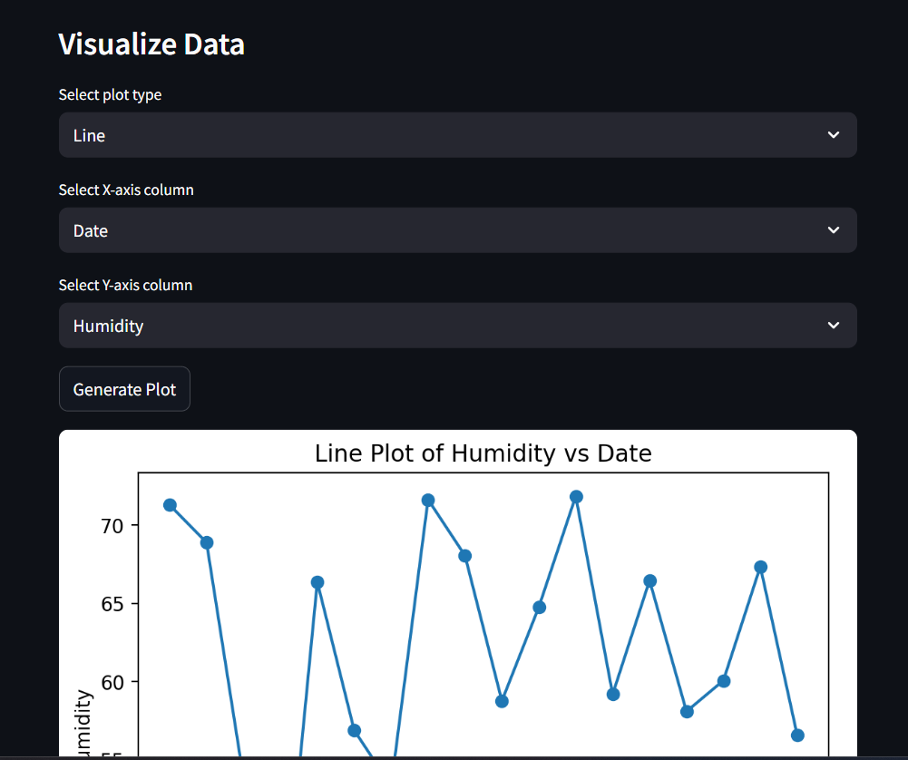
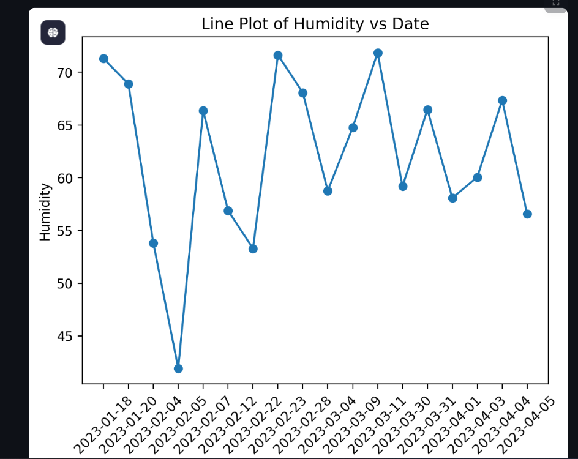
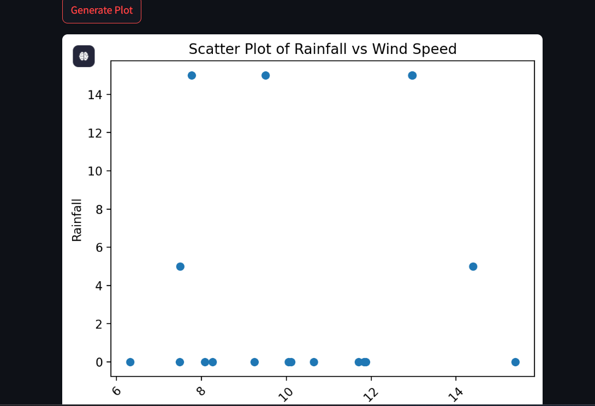
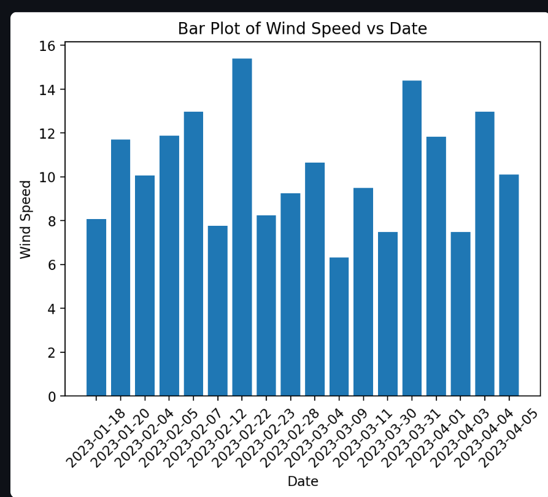

# 📊 Data Analysis App

Welcome to my **Streamlit Data Analysis App**—a project designed to showcase practical data science skills and interactive data exploration.

This application enables users to upload CSV files, filter and summarize datasets, and visualize data through a variety of interactive plots—all within a user-friendly web interface.

## 🚀 Key Features

- Upload and preview CSV datasets
- Generate summary statistics and data previews
- Filter data by column and value
- Visualize data with Line, Bar, Histogram, and Scatter plots
- Built using [Streamlit](https://streamlit.io/) and [Matplotlib](https://matplotlib.org/)

## 🎬 Demo

Curious about the app in action?  
Watch a short demo video demonstrating data upload, filtering, and visualization:

[](https://youtu.be/tq1h-iL-Vuo)

## 📸 Screenshots

Explore the app’s core features through these screenshots:

| Interactive Plotting | Line Plot | Bar Plot | Scatter Plot |
|:--------------------:|:---------:|:--------:|:------------:|
|  |  |  |  |

*Upload datasets, apply filters, and generate insightful visualizations in a streamlined interface.*

For more examples, see the `screenshots` directory.

## 🛠️ Getting Started

1. **Clone the repository:**
    ```sh
    git clone https://github.com/Shakhoyat/python-website-with-streamlit101.git
    cd python-website-with-streamlit101
    ```

2. **Install dependencies:**
    ```sh
    pip install -r requirements.txt
    ```

3. **Run the app:**
    ```sh
    streamlit run main.py
    ```

4. **Open your browser:**  
    Visit [http://localhost:8501](http://localhost:8501) to access the app.

## 📂 Sample Data

A sample CSV file is provided for testing:  
[Sample_Data_for_Plotting_and_Filtering.csv](Sample_Data_for_Plotting_and_Filtering.csv)

## 📝 Notes

- This project demonstrates end-to-end data analysis and visualization workflows.
- Feedback and contributions are welcome.

---

Developed with a passion for data science and interactive analytics.
